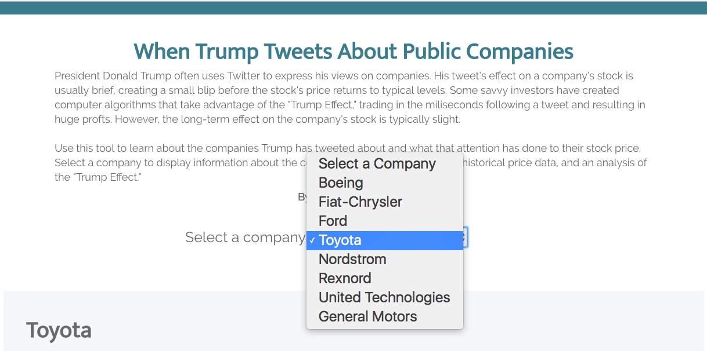
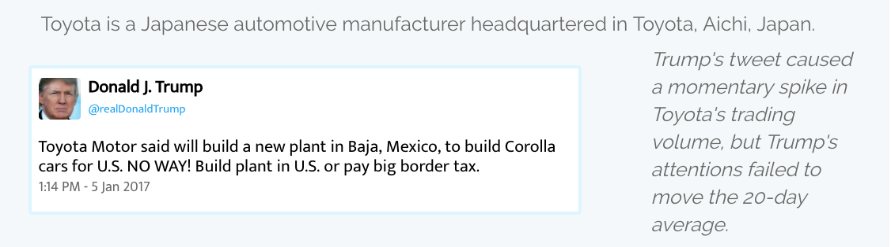
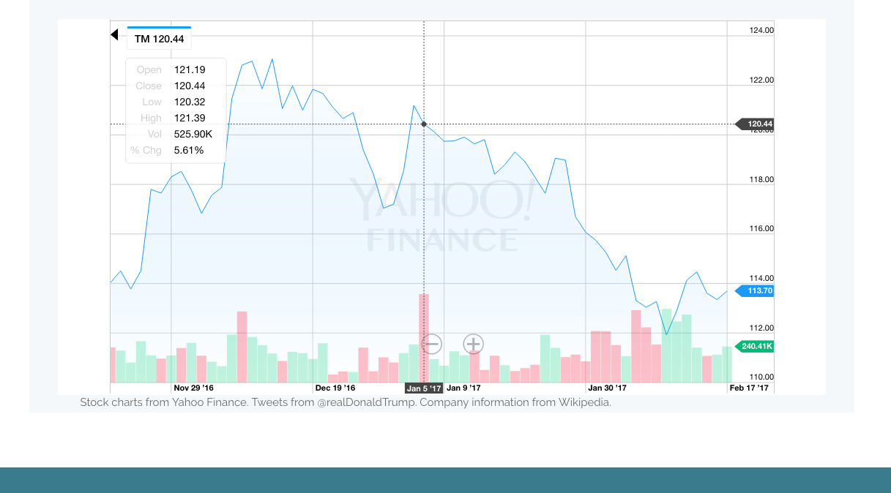

# Tracking-the-Trump-Effect

> An application to see how the stock market responds to Donald Trump's tweets about companies. A responsive Vue.js single page application.

## Build Setup

``` bash
# install dependencies
npm install
npm install axios

# serve with hot reload at localhost:8080
npm run dev

# build for production with minification
npm run build

# build for production and view the bundle analyzer report
npm run build --report
```

For detailed explanation on how things work, checkout the [guide](http://vuejs-templates.github.io/webpack/) and [docs for vue-loader](http://vuejs.github.io/vue-loader).

## Components
> App.vue

> Parent: about.vue

> stockData.vue, tweetData.Vue, dropDown.vue, analysis.vue and Intro.vue call back to About.vue

## Static Elements
> JSON:

> twitter-data.json

> Photos:

> Donald Trump Twitter Bio Pic: dt.jpg

> Yahoo Finance Graphs for each company are named according to '(TickerSymbol).png'

## Installation Notes
> This project uses Bootstrap and jQuery. I have included the files in this package, but if you encounter trouble make sure they are installed correctly.

## Screencaps

### Header and Drop-Down Menu
> Here is the working header and drop-down menu.

> The drop-down menu should call up data on the company from twitter-data.json.



### Company Info, Twitter, Analysis
> Here is how the company information, twitter information and analysis should appear. In mobile each div expands to full-width.



### Stock Charts
> After trying to implement HighCharts, HighStocks, D3 and GoogleCharts, I settled on screenshots of Yahoo Finance data in order to meet my submission deadline. I will continue to work with data and various visualization tools after this project is graded, with the final goal being to create a component that calls company-specific stock data from a JSON file.



## Credits for information used

### Charts
> GM Chart: https://finance.yahoo.com/chart/GM#eyJtdWx0aUNvbG9yTGluZSI6ZmFsc2UsImJvbGxpbmdlclVwcGVyQ29sb3IiOiIjZTIwMDgxIiwiYm9sbGluZ2VyTG93ZXJDb2xvciI6IiM5NTUyZmYiLCJtZmlMaW5lQ29sb3IiOiIjNDVlM2ZmIiwibWFjZERpdmVyZ2VuY2VDb2xvciI6IiNmZjdiMTIiLCJtYWNkTWFjZENvbG9yIjoiIzc4N2Q4MiIsIm1hY2RTaWduYWxDb2xvciI6IiMwMDAwMDAiLCJyc2lMaW5lQ29sb3IiOiIjZmZiNzAwIiwic3RvY2hLTGluZUNvbG9yIjoiI2ZmYjcwMCIsInN0b2NoRExpbmVDb2xvciI6IiM0NWUzZmYiLCJyYW5nZSI6IjNtbyJ9

> UTX Chart: https://finance.yahoo.com/chart/UTX#eyJtdWx0aUNvbG9yTGluZSI6ZmFsc2UsImJvbGxpbmdlclVwcGVyQ29sb3IiOiIjZTIwMDgxIiwiYm9sbGluZ2VyTG93ZXJDb2xvciI6IiM5NTUyZmYiLCJtZmlMaW5lQ29sb3IiOiIjNDVlM2ZmIiwibWFjZERpdmVyZ2VuY2VDb2xvciI6IiNmZjdiMTIiLCJtYWNkTWFjZENvbG9yIjoiIzc4N2Q4MiIsIm1hY2RTaWduYWxDb2xvciI6IiMwMDAwMDAiLCJyc2lMaW5lQ29sb3IiOiIjZmZiNzAwIiwic3RvY2hLTGluZUNvbG9yIjoiI2ZmYjcwMCIsInN0b2NoRExpbmVDb2xvciI6IiM0NWUzZmYiLCJyYW5nZSI6IjNtbyJ9

> RXN Chart: https://finance.yahoo.com/chart/RXN#eyJtdWx0aUNvbG9yTGluZSI6ZmFsc2UsImJvbGxpbmdlclVwcGVyQ29sb3IiOiIjZTIwMDgxIiwiYm9sbGluZ2VyTG93ZXJDb2xvciI6IiM5NTUyZmYiLCJtZmlMaW5lQ29sb3IiOiIjNDVlM2ZmIiwibWFjZERpdmVyZ2VuY2VDb2xvciI6IiNmZjdiMTIiLCJtYWNkTWFjZENvbG9yIjoiIzc4N2Q4MiIsIm1hY2RTaWduYWxDb2xvciI6IiMwMDAwMDAiLCJyc2lMaW5lQ29sb3IiOiIjZmZiNzAwIiwic3RvY2hLTGluZUNvbG9yIjoiI2ZmYjcwMCIsInN0b2NoRExpbmVDb2xvciI6IiM0NWUzZmYiLCJyYW5nZSI6IjFtbyJ9

> JWN Chart: https://finance.yahoo.com/chart/JWN#eyJtdWx0aUNvbG9yTGluZSI6ZmFsc2UsImJvbGxpbmdlclVwcGVyQ29sb3IiOiIjZTIwMDgxIiwiYm9sbGluZ2VyTG93ZXJDb2xvciI6IiM5NTUyZmYiLCJtZmlMaW5lQ29sb3IiOiIjNDVlM2ZmIiwibWFjZERpdmVyZ2VuY2VDb2xvciI6IiNmZjdiMTIiLCJtYWNkTWFjZENvbG9yIjoiIzc4N2Q4MiIsIm1hY2RTaWduYWxDb2xvciI6IiMwMDAwMDAiLCJyc2lMaW5lQ29sb3IiOiIjZmZiNzAwIiwic3RvY2hLTGluZUNvbG9yIjoiI2ZmYjcwMCIsInN0b2NoRExpbmVDb2xvciI6IiM0NWUzZmYiLCJyYW5nZSI6IjNtbyJ9

> F Chart: https://finance.yahoo.com/chart/F#eyJtdWx0aUNvbG9yTGluZSI6ZmFsc2UsImJvbGxpbmdlclVwcGVyQ29sb3IiOiIjZTIwMDgxIiwiYm9sbGluZ2VyTG93ZXJDb2xvciI6IiM5NTUyZmYiLCJtZmlMaW5lQ29sb3IiOiIjNDVlM2ZmIiwibWFjZERpdmVyZ2VuY2VDb2xvciI6IiNmZjdiMTIiLCJtYWNkTWFjZENvbG9yIjoiIzc4N2Q4MiIsIm1hY2RTaWduYWxDb2xvciI6IiMwMDAwMDAiLCJyc2lMaW5lQ29sb3IiOiIjZmZiNzAwIiwic3RvY2hLTGluZUNvbG9yIjoiI2ZmYjcwMCIsInN0b2NoRExpbmVDb2xvciI6IiM0NWUzZmYiLCJyYW5nZSI6IjF5In0%3D

> BA Chart: https://finance.yahoo.com/chart/BA#eyJtdWx0aUNvbG9yTGluZSI6ZmFsc2UsImJvbGxpbmdlclVwcGVyQ29sb3IiOiIjZTIwMDgxIiwiYm9sbGluZ2VyTG93ZXJDb2xvciI6IiM5NTUyZmYiLCJtZmlMaW5lQ29sb3IiOiIjNDVlM2ZmIiwibWFjZERpdmVyZ2VuY2VDb2xvciI6IiNmZjdiMTIiLCJtYWNkTWFjZENvbG9yIjoiIzc4N2Q4MiIsIm1hY2RTaWduYWxDb2xvciI6IiMwMDAwMDAiLCJyc2lMaW5lQ29sb3IiOiIjZmZiNzAwIiwic3RvY2hLTGluZUNvbG9yIjoiI2ZmYjcwMCIsInN0b2NoRExpbmVDb2xvciI6IiM0NWUzZmYiLCJyYW5nZSI6IjJ5In0%3D

> TM Chart: https://finance.yahoo.com/chart/TM#eyJtdWx0aUNvbG9yTGluZSI6ZmFsc2UsImJvbGxpbmdlclVwcGVyQ29sb3IiOiIjZTIwMDgxIiwiYm9sbGluZ2VyTG93ZXJDb2xvciI6IiM5NTUyZmYiLCJtZmlMaW5lQ29sb3IiOiIjNDVlM2ZmIiwibWFjZERpdmVyZ2VuY2VDb2xvciI6IiNmZjdiMTIiLCJtYWNkTWFjZENvbG9yIjoiIzc4N2Q4MiIsIm1hY2RTaWduYWxDb2xvciI6IiMwMDAwMDAiLCJyc2lMaW5lQ29sb3IiOiIjZmZiNzAwIiwic3RvY2hLTGluZUNvbG9yIjoiI2ZmYjcwMCIsInN0b2NoRExpbmVDb2xvciI6IiM0NWUzZmYiLCJyYW5nZSI6IjNtbyJ9

> FCAU Chart: https://finance.yahoo.com/chart/FCAU#eyJjdXN0b21SYW5nZUVuZCI6MTQ4NTgzODc5OSwiY3VzdG9tUmFuZ2VTdGFydCI6MTQ4MzMzMzIwMCwibXVsdGlDb2xvckxpbmUiOmZhbHNlLCJib2xsaW5nZXJVcHBlckNvbG9yIjoiI2UyMDA4MSIsImJvbGxpbmdlckxvd2VyQ29sb3IiOiIjOTU1MmZmIiwibWZpTGluZUNvbG9yIjoiIzQ1ZTNmZiIsIm1hY2REaXZlcmdlbmNlQ29sb3IiOiIjZmY3YjEyIiwibWFjZE1hY2RDb2xvciI6IiM3ODdkODIiLCJtYWNkU2lnbmFsQ29sb3IiOiIjMDAwMDAwIiwicnNpTGluZUNvbG9yIjoiI2ZmYjcwMCIsInN0b2NoS0xpbmVDb2xvciI6IiNmZmI3MDAiLCJzdG9jaERMaW5lQ29sb3IiOiIjNDVlM2ZmIn0%3D

### Analysis insights from:

> Quartz Article: https://qz.com/907408/new-analysis-proves-trumps-tweets-attacking-companies-are-mostly-just-distractions/

> Bloomberg: https://www.bloomberg.com/gadfly/articles/2017-01-24/trump-s-tweets-don-t-turn-out-to-be-useful-stock-tips

> Reuters: http://www.reuters.com/article/us-usa-trump-rexnord-idUSKBN13S0PU

> MSN: https://www.msn.com/en-us/money/markets/president-elect-trump-targets-rexnord-with-a-tweet/vp-AAlbuu0

> Financial Times: https://ftalphaville.ft.com/2017/01/06/2181929/stop-worrying-about-trumps-tweets/?ftcamp=engage/capi/widget/client/openft/b2b

> WSJ: http://blogs.wsj.com/moneybeat/2016/12/05/rexnord-inches-lower-after-trump-tweets/

> Investors.com: http://www.investors.com/news/trump-carrier-reach-deal-on-keeping-jobs-at-indiana-plant/

> MarketWatch: http://www.marketwatch.com/story/gms-stock-falls-after-trump-tweet-on-mexico-production-2017-01-03

### Company Information From:

> FCAU: https://en.wikipedia.org/wiki/Fiat_Chrysler_Automobiles

> T: https://en.wikipedia.org/wiki/Toyota

> JWN: https://en.wikipedia.org/wiki/Nordstrom

> Carrier/UTX: https://en.wikipedia.org/wiki/Carrier_Corporation & https://en.wikipedia.org/wiki/United_Technologies

> F: https://en.wikipedia.org/wiki/Ford_Motor_Company

> RXN: https://en.wikipedia.org/wiki/Rexnord_Corporation

> GM: https://en.wikipedia.org/wiki/General_Motors
